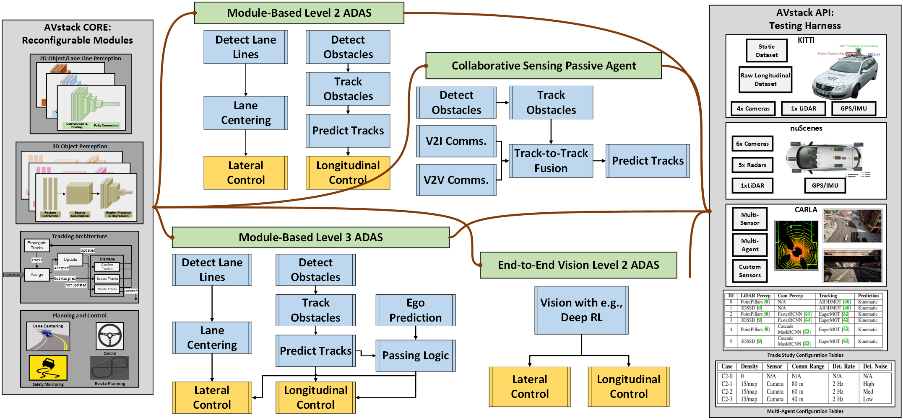
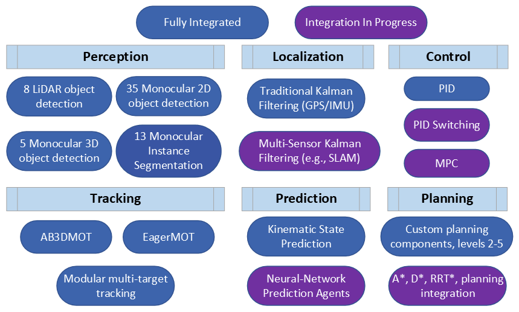
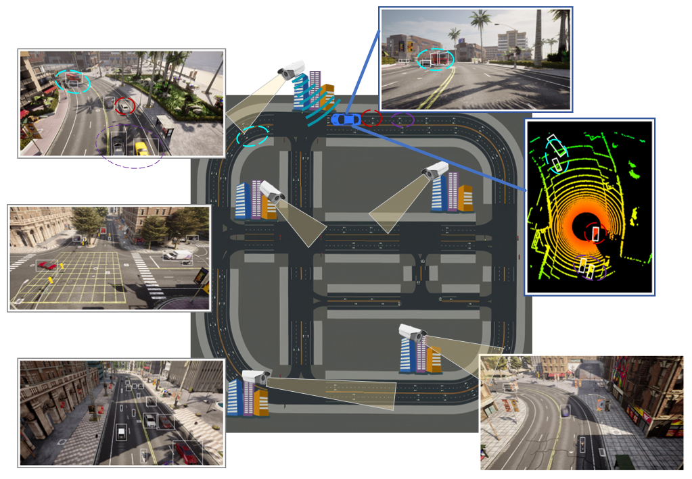

# AVstack Documentation

 -->

This serves as the authoritative spot for documentation of [AVstack][avstack-lab]. When we say AVstack, we refer to the family of libraries including (but not limited to) [avstack-core][avstack-core], [avstack-api][avstack-api], and the [carla-sandbox][carla-sandbox].  Many important AVstack projects are documented in the library documentation dropdown. More importantly, this site collates the all-important how-to guides for getting started with AVstack.

**NOTE:** the documentation is under vigorous construction.

## How did we get here?

The idea of AVstack was conceived out of some opportunities (read: frustrations) from several autonomous vehicle (AV) research projects. Time and again when benchmarking new algorithms, testing new datasets, or performing a security analysis, we were asked: *integrate your new &lt;insert project here&gt; with an existing simulator/algorithm/dataset/foo-bar*. As much as I appreciate building the academic corpus, I really dislike the process of understanding other people's (hacky) conventions enough to compare my work with theirs. Even worse than disparate conventions, if a different dataset were involved, all bets were off; if a simulator were required: kiss reproducibility goodbye. In an age where tech giants dominate the (semi) open-source market for cutting-edge research-grade technology, we're here to establish some sanity. 

AV research is not-so-slowly drifting away from its status as an accessible research topic. State-of-the-art "all-purpose" autonomous vehicle platforms (e.g., [Apollo][apollo], [Autoware][autoware]) have tens-of-thousands of version control commits of changes in low-level programming languages. Picking up proficiency in a new platform is no small task, even for the most seasoned developer. With the increasing barrier of AV development, modern research has narrowed in to niche and debatably closed conversations. Our meta-analysis of recent results suggested that (i) recent algorithm performance gains are hyper-specific and marginal, (ii) transfer testing across datasets is simply too difficult, (iii) transfer testing *nearly never* occurs between datasets and simulators. Moreover, conventions used by benchmark datasets and simulators can vary wildly. This leads to the unfortunate consequences of: a large barrier to developing AV software, inflexibility in proposed "state of the art" results, and an inability to verify recent works with differing configurations or conventions.  

## What's in it for you?

To meet these needs, we developed AVstack as an open-source, reconfigurable software platform for AV design, implementation, test, and analysis. What separates AVstack from others includes

- Unification of geometric conventions
- Integration of third-party libraries for AV algorithms
- Reconfigurable AV designs; with or without control
- Modular testing with metrics at multiple scales
- Consistent interfacing between different datasets
- Compatibility with AV simulators
- Low-barrier adoption with high-level languages

 

Diverse Algorithms         |  Connected Environment
:-------------------------:|:-------------------------:
  |  

## Organization

The AVstack family of repositories rely on our [**CORE**][avstack-core] and [**API**][avstack-api] libraries. The core library provides data-source-agnostic definition of AV modules and implementation of algorithms. Meanwhile, the API library provides a simple interface for using benchmark AV datasets and simulators.

In this documentation, we provide a set of how-to guides to help you get started with AVstack. To supplement, we also provide API-level documentation for the core and API libraries as well as for the [carla-sandbox][carla-sandbox]. 

  

[apollo]: https://github.com/ApolloAuto/apollo
[autoware]: https://gitlab.com/autowarefoundation/autoware.auto
[avstack-lab]: https://github.com/avstack-lab
[avstack-core]: https://github.com/avstack-lab/lib-avstack-core
[avstack-api]: https://github.com/avstack-lab/lib-avstack-api
[carla-sandbox]: https://github.com/avstack-lab/carla-sandbox